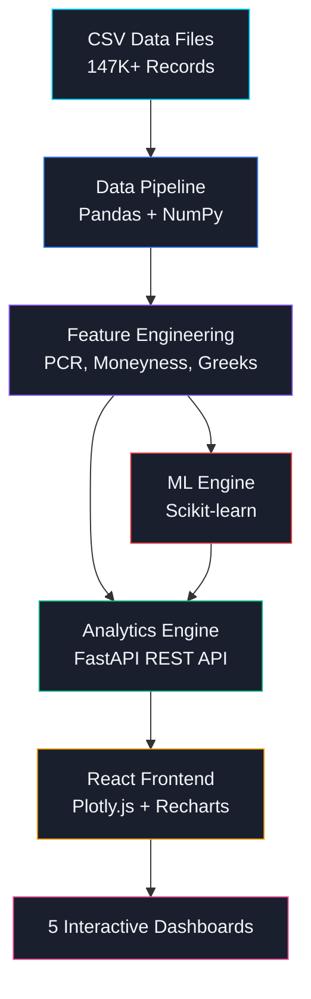

# ⚡ OptiVision AI — AI-Powered Options Market Analytics


> **Team Antigravity** | CodeForge Hackathon — FOSS MPSTME × TAQNEEQ

---

## 🎯 Problem Statement

Raw options market data (147K+ records across NIFTY options) is overwhelming — traders and analysts struggle to extract actionable signals from multi-dimensional data spanning strikes, expiries, volume, and open interest.

**OptiVision AI** transforms this noise into signal through:
- 🤖 **AI-powered anomaly detection** using Isolation Forest
- 🌊 **Interactive 3D volatility surfaces** for multi-dimensional analysis
- 📊 **Real-time analytics dashboards** with 13+ visualization types
- 🔍 **Intelligent pattern recognition** with KMeans clustering

---

## 🏗️ Architecture



---

## 🚀 Quick Start

### One-Command Start (Docker)
```bash
docker-compose up --build
```
Frontend: `http://localhost:5173` | API: `http://localhost:8000`

### Manual Setup

**Backend:**
```bash
pip install -r backend/requirements.txt
uvicorn backend.main:app --reload --port 8000
```

**Frontend:**
```bash
cd frontend
npm install
npm run dev
```

---

## 📊 Features & Dashboards

| Dashboard | Description |
|-----------|-------------|
| **📊 Market Dashboard** | Overview with 6 KPI cards, spot price chart, PCR timeline, OI distribution |
| **📋 Options Chain** | Strike-wise OI/Volume, Max Pain calculation, OI heatmap (strike × date) |
| **🤖 Anomaly Detection** | Isolation Forest ML model, severity classification, KMeans strike clustering |
| **🌊 Volatility Surface** | Interactive 3D surfaces (IV + Volume), 2D contour projection |
| **📈 Volume Analysis** | CE/PE comparison, OI change analysis, volume split pie chart, top active strikes |

### AI/ML Models
- **Isolation Forest**: Detects ~5% anomalous activity across 9 feature dimensions
- **KMeans Clustering**: Groups strikes into behavioral clusters (Bullish/Bearish/High Activity/Low Activity)
- **Feature Engineering**: 15+ computed features including PCR, moneyness, vol-OI ratios, days to expiry

---

## 🛠️ Tech Stack (FOSS)

| Layer | Technology | Purpose |
|-------|-----------|---------|
| **Data Processing** | Pandas, NumPy | ETL, feature engineering |
| **Machine Learning** | Scikit-learn | Isolation Forest, KMeans |
| **Backend API** | FastAPI, Uvicorn | REST API (13 endpoints) |
| **Frontend** | React 19, Vite | SPA with routing |
| **Visualization** | Plotly.js, Recharts | Interactive 2D/3D charts |
| **Icons** | Lucide React | Consistent icon system |
| **Containerization** | Docker | Multi-stage build |
| **CI/CD** | GitHub Actions | Lint, test, build checks |

---

## 📁 Project Structure

```
codeforge/
├── backend/
│   ├── main.py            # FastAPI server (13 API endpoints)
│   ├── data_loader.py     # Data pipeline + feature engineering
│   ├── analytics.py       # Analytics functions (OI, PCR, Max Pain, heatmaps)
│   ├── ml_engine.py       # Isolation Forest + KMeans models
│   └── requirements.txt
├── frontend/
│   ├── src/
│   │   ├── App.jsx        # Router + sidebar navigation
│   │   ├── api.js         # API client
│   │   ├── index.css      # Design system (dark trading terminal theme)
│   │   └── pages/
│   │       ├── Dashboard.jsx
│   │       ├── OptionsChain.jsx
│   │       ├── AnomalyDetection.jsx
│   │       ├── VolatilitySurface.jsx
│   │       └── VolumeAnalysis.jsx
│   └── package.json
├── data/                   # NIFTY options CSVs (3 expiry cycles)
├── Dockerfile              # Multi-stage build
├── docker-compose.yml      # One-command deployment
├── .github/workflows/ci.yml  # CI/CD pipeline
└── README.md
```

---

## ⚙️ API Endpoints

| Method | Endpoint | Description |
|--------|----------|-------------|
| GET | `/api/overview` | Market overview with KPIs |
| GET | `/api/expiries` | Available expiry dates |
| GET | `/api/oi-by-strike` | OI distribution by strike |
| GET | `/api/volume-by-strike` | Volume distribution by strike |
| GET | `/api/pcr-timeline` | Put-Call Ratio over time |
| GET | `/api/spot-price` | Spot price timeline |
| GET | `/api/oi-changes` | OI change analysis |
| GET | `/api/volatility-surface` | 3D surface data |
| GET | `/api/max-pain` | Max Pain calculation |
| GET | `/api/heatmap` | OI/Volume heatmap data |
| GET | `/api/anomalies/summary` | ML anomaly summary |
| GET | `/api/anomalies/details` | Detailed anomaly list |
| GET | `/api/clusters` | KMeans cluster results |

---

## 📋 DevOps & Automation

- **Docker**: Multi-stage build (Node Alpine → Python Slim)
- **CI/CD**: GitHub Actions pipeline runs on every push:
  - ✅ Backend lint (flake8)
  - ✅ Backend unit tests (pytest)
  - ✅ Frontend build verification
  - ✅ Docker image build check
- **Version Control**: Conventional commits, feature branching

---

## 📜 FOSS Attribution

This project is built entirely on Free and Open Source Software:

- [Python](https://python.org) — Programming Language (PSF License)
- [FastAPI](https://fastapi.tiangolo.com) — Web Framework (MIT License)
- [Pandas](https://pandas.pydata.org) — Data Analysis (BSD License)
- [NumPy](https://numpy.org) — Numerical Computing (BSD License)
- [Scikit-learn](https://scikit-learn.org) — Machine Learning (BSD License)
- [React](https://react.dev) — UI Library (MIT License)
- [Vite](https://vitejs.dev) — Build Tool (MIT License)
- [Plotly.js](https://plotly.com/javascript/) — Visualization (MIT License)
- [Recharts](https://recharts.org) — Charts (MIT License)
- [Lucide](https://lucide.dev) — Icons (ISC License)
- [Docker](https://docker.com) — Containerization (Apache 2.0)

---

## 👥 Team Antigravity

Built with ❤️ during **CodeForge – The Open Innovation Gauntlet** hackathon at MPSTME, Mumbai.

---

## 📄 License

MIT License — Free and Open Source
